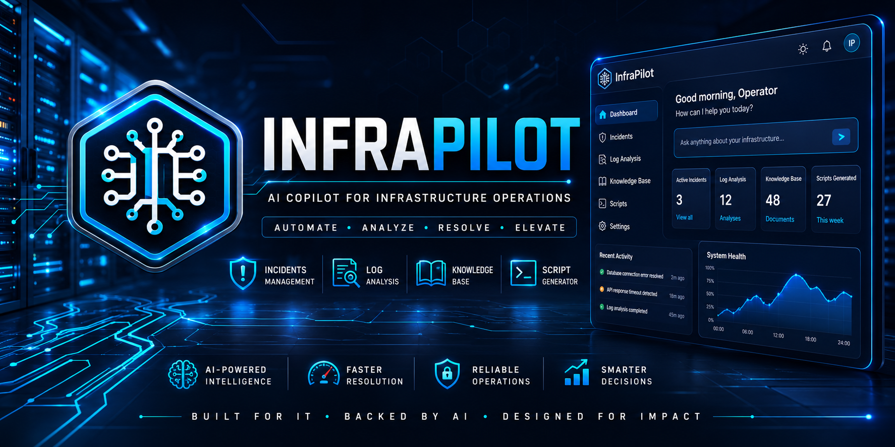
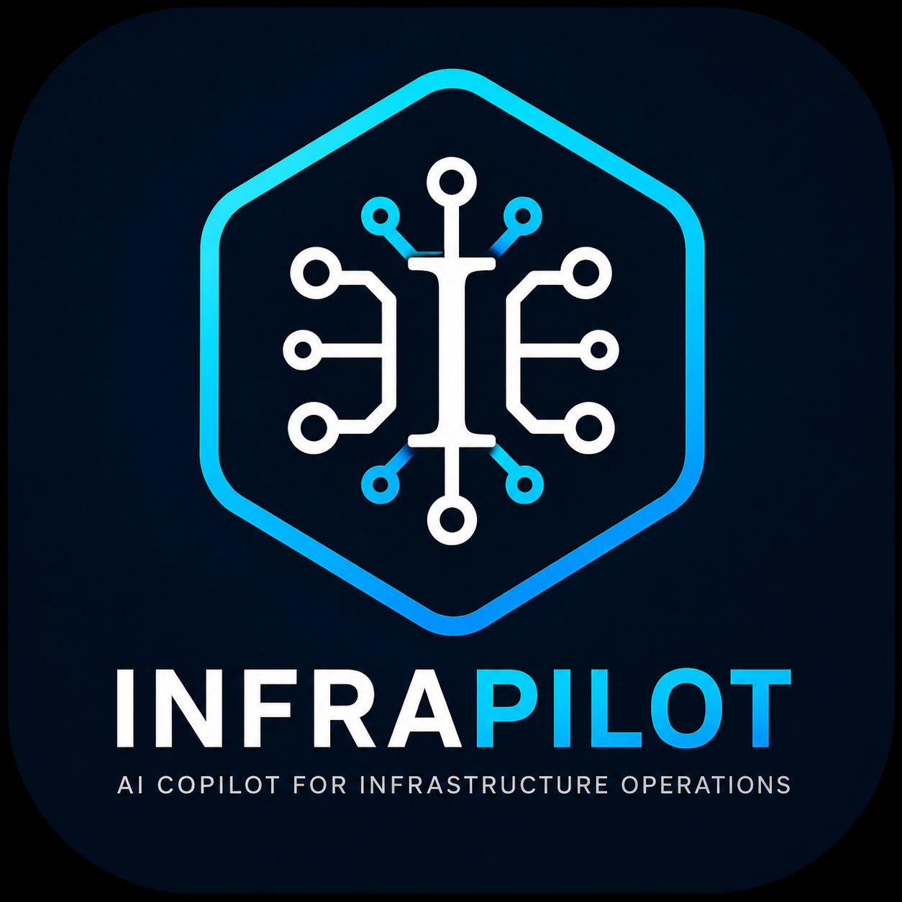
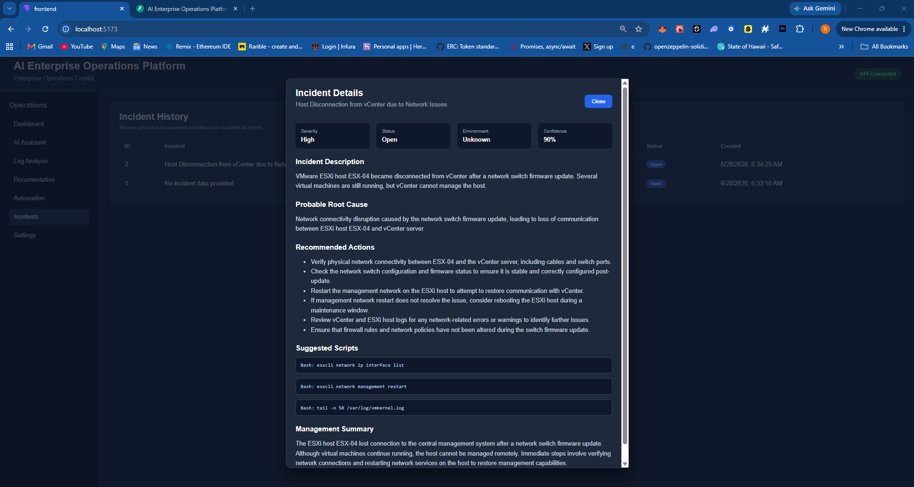
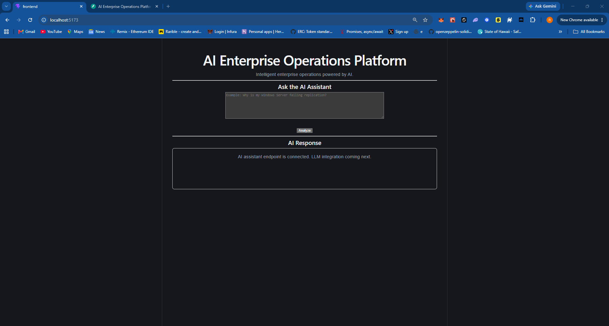

<p align="center">
  
</p>

<p align="center">
  
</p>

<h1 align="center">InfraPilot</h1>

<h3 align="center">
Enterprise AI Copilot for Infrastructure Operations
</h3>

<p align="center">
  
  
  
  
  
  
</p>

---

## Overview

**InfraPilot** is an AI-powered infrastructure operations platform designed to help Systems Administrators, Infrastructure Engineers, DevOps Engineers, and IT Operations teams troubleshoot incidents, analyze environments, generate remediation steps, and automate operational workflows.

The long-term vision is to provide a unified AI assistant capable of supporting Windows Server, VMware, Linux, Azure, AWS, Kubernetes, networking, scripting, documentation, and enterprise automation from a single interface.

---

## Feature Showcase

### AI Incident Analysis

InfraPilot analyzes infrastructure incidents and returns structured operational intelligence instead of generic chatbot responses.

Current AI output includes:

* Incident classification
* Severity assessment
* Confidence score
* Probable root cause
* Recommended actions
* Suggested scripts
* Executive management summary

### Incident Management

Sprint 1 includes a working incident management workflow:

* AI-powered incident analysis
* SQLite persistence
* Incident history table
* Severity badges
* Status badges
* Incident details modal

---

## Screenshots

### Incident History

<p align="center">
  
</p>

### Full-Stack AI Workflow

<p align="center">
  
</p>

---

## Architecture

```text
                 React + Vite Frontend
                          |
                          v
                  Axios API Client
                          |
                          v
                    FastAPI Backend
                          |
        -------------------------------------
        |                                   |
        v                                   v
   AI Service Layer                 Repository Layer
        |                                   |
        v                                   v
    OpenAI API                      SQLite Database
```

### Backend Pattern

InfraPilot follows a layered backend architecture:

```text
API Router
   |
   v
Service Layer
   |
   v
Repository Layer
   |
   v
Database
```

This keeps AI logic, API routing, and database access separated so the platform can scale cleanly as new modules are added.

---

## Technology Stack

### Frontend

* React
* Vite
* Axios
* CSS

### Backend

* FastAPI
* SQLAlchemy
* SQLite
* OpenAI API
* Pydantic

### Project Practices

* Git version control
* Conventional commit messages
* Environment-based configuration
* Prompt files separated from code
* Product documentation
* Release notes

---

## Project Structure

```text
InfraPilot/
|
├── backend/
│   ├── app/
│   │   ├── api/
│   │   ├── core/
│   │   ├── database/
│   │   ├── models/
│   │   ├── prompts/
│   │   ├── services/
│   │   └── utils/
│   ├── main.py
│   └── requirements.txt
|
├── frontend/
│   ├── src/
│   │   ├── api/
│   │   ├── assets/
│   │   ├── components/
│   │   ├── config/
│   │   ├── pages/
│   │   └── styles/
│   └── package.json
|
├── docs/
├── portfolio-assets/
├── .env.example
├── .gitignore
├── LICENSE
└── README.md
```

---

## Getting Started

### Prerequisites

Install:

* Python 3.13+
* Node.js
* Git
* OpenAI API key

---

## Backend Setup

```powershell
cd C:\InfraPilot\backend
python -m venv venv
.\venv\Scripts\Activate.ps1
pip install -r requirements.txt
```

Create a `.env` file in the backend folder:

```env
OPENAI_API_KEY=your_openai_api_key_here
```

Start the backend:

```powershell
uvicorn main:app --reload
```

Backend runs at:

```text
http://127.0.0.1:8000
```

Swagger documentation:

```text
http://127.0.0.1:8000/docs
```

---

## Frontend Setup

```powershell
cd C:\InfraPilot\frontend
npm install
npm run dev
```

Frontend runs at:

```text
http://localhost:5173
```

---

## Roadmap

### Sprint 1 — Foundation

Completed:

* React frontend
* FastAPI backend
* OpenAI integration
* Structured AI responses
* SQLite persistence
* Incident history
* Incident details modal
* GitHub project foundation

### Sprint 2 — AI Operations

Planned:

* Log upload and analysis
* Windows Event Log support
* Linux log analysis
* VMware log analysis
* AI-generated remediation guidance

### Sprint 3 — Knowledge Base

Planned:

* Document upload
* Retrieval-Augmented Generation
* Internal runbook search
* AI answers with source references

### Sprint 4 — Automation

Planned:

* PowerShell generation
* Bash generation
* Script explanations
* Safety checks
* Runbook automation

### Sprint 5 — Enterprise Integrations

Planned:

* VMware
* Active Directory
* Azure
* AWS
* Kubernetes
* Microsoft Graph

---

## Why InfraPilot?

Modern infrastructure teams operate across complex environments. Troubleshooting often requires jumping between logs, tickets, scripts, dashboards, documentation, and tribal knowledge.

InfraPilot is being built to centralize that workflow into an AI-native operations console.

The goal is to reduce incident resolution time, improve operational consistency, and give engineers a practical AI copilot for real infrastructure work.

---

## License

This project is licensed under the MIT License.
